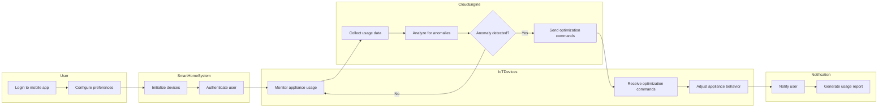

# Smart Home Energy Management System - Final Exam 

## 📌 Project Overview
*Course:* Database Development with PL/SQL (INSY 8311)  
*Student:* NGIRINSHUTI MUGISHA Joachim  
*Student ID:* 27256  
*Lecturer:* Eric Maniraguha  

---

## 🎯 Problem Definition-Phase I: Problem Statement
*Title:* Smart Home Energy Management System  
*Objective:*  
Develop an IoT-driven Oracle database solution to monitor, control, and optimize residential energy consumption using PL/SQL.  

*Key Challenges Addressed:*  
- High energy costs due to inefficient appliance usage.  
- Lack of real-time insights into energy patterns.  
- Manual scheduling of home appliances leading to wasted energy.  

---

## 🌍 Context & Target Users
*Context:*  
- Deployed in residential homes with IoT-enabled devices (e.g., smart thermostats, lights).  
- Integrates with cloud analytics for dynamic pricing adjustments.  

*Target Users:*  
- Homeowners seeking cost savings.  
- Utility companies for load balancing.  
- Environmental advocates promoting sustainable energy use.  

---

## 🚀 Project Goals
1. *Real-Time Monitoring:*  
   - Track live energy usage per appliance via a user portal.  
2. *Automated Controls:*  
   - Adjust HVAC and lighting based on schedules/energy tariffs.  
3. *Data-Driven Insights:*  
   - Generate reports on consumption trends and savings.  
4. *Alerts:*  
   - Notify users of abnormal usage or peak-hour spikes.  

---

## 📊 Core Entities (Phase I Preview)
| Entity               | Description                                  |
|----------------------|----------------------------------------------|
| User               | Homeowners managing devices and reports.     |
| Home               | Physical location with IoT sensors.          |
| Appliance          | Smart devices (e.g., fridge, AC).            |
| EnergyUsageRecord  | Timestamped energy consumption logs.         |

*Relationships:*  
- *User → Homes* (1:N)  
- *Home → Appliances* (1:N)  
- *Appliance → EnergyUsageRecord* (1:N)  

 

# 📊 Phase II: Business Process Modeling 

## 👨‍💻 PL/SQL Capstone Project | Smart Home Energy Management System

---

## 🧠 Objective

This phase models the core **business process** of a smart energy management system within a **residential context**, aligned with Management Information Systems (MIS) principles.  
The model illustrates how smart devices, users, and analytics platforms interact to optimize household energy consumption.

---

## 📌 Scope

**Process Modeled**:  
> *Smart Energy Usage Optimization*

**MIS Relevance**:
- Supports decision-making with real-time energy data
- Enhances automation and operational efficiency
- Promotes sustainable energy consumption behaviors

**Expected Outcomes**:
- Lowered energy costs  
- Data-driven energy behavior recommendations  
- Automated appliance control via smart schedules  

---

## 👥 Key Entities & Actors

| Entity | Role |
|-------|------|
| `User` | Owns homes, configures preferences |
| `Smart Home System` | Central control unit managing appliances |
| `IoT Devices` | Sensors/actuators monitoring and controlling energy use |
| `Mobile App` | User interface for control and insights |
| `Cloud Engine` | Performs analytics, scheduling, and anomaly detection |

---

# 📊 Diagram Explanation: Smart Home Energy Optimization

## 🧠 Components & Interactions

- **User**: Initiates the system and sets energy preferences.
- **System**: Authenticates and sets up connected IoT devices.
- **IoT Devices**: Continuously track energy use in real time.
- **Cloud Engine**: Collects and analyzes data to optimize usage.

## 🔍 Decision Logic

- When the system detects abnormal usage (peak hour, waste, etc.), it issues commands to optimize appliance behavior.
- If everything is normal, it just keeps monitoring.

## 📈 MIS Support

- **Informed Decisions**: Energy reports allow users to understand their habits.
- **Automation**: Devices respond without user intervention.
- **Data Flow**: From user input → IoT monitoring → cloud analytics → action.

    

